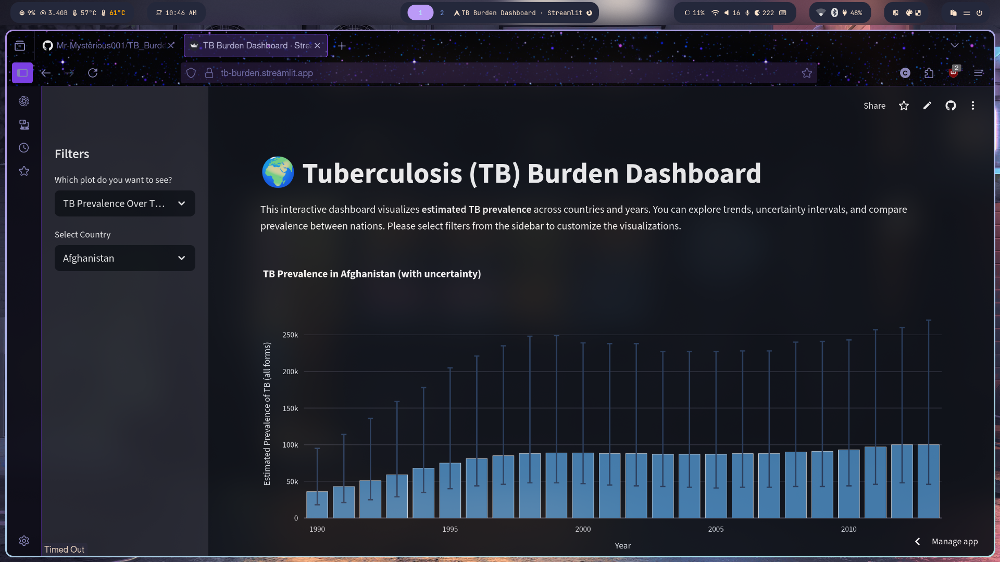

# TB Burden Country Analysis

This is an ongoing **analysis of tuberculosis (TB) prevalence across countries** using the [TB_Burden_Country_Project dataset](https://public.tableau.com/app/sample-data/TB_Burden_Country.csv) from Tableau. The project is currently in the initial stages, and more visualizations and insights will be added over time.

## Tools & Libraries

- **Python** (Jupyter Notebook)  
- **Pandas** – data manipulation  
- **Matplotlib** – visualization  

## Visualizations

Initial visualizations saved in this project:

### TB Prevalence in Afghanistan

This plot shows TB prevalence trends in Afghanistan over time.

### Comparison of TB Prevalence by Country (1990 vs 2013)

.png)

This side-by-side comparison highlights changes in TB prevalence across countries between 1990 and 2013.

## Project Status

- ✅ Initial data exploration  
- ✅ Basic visualizations  
- 🔜 Streamlit dashboard and additional visualizations (upcoming)  

## How to Run

1. Download the dataset: [TB_Burden_Country.csv](https://public.tableau.com/app/sample-data/TB_Burden_Country.csv)  
2. Open the Jupyter Notebook and explore the analysis.  
3. Refer to the embedded images above for the current visualizations.

## Future Work

- Build an **interactive Streamlit dashboard** for dynamic analysis.  
- Include additional visualizations such as **trends by region**, **error bars for TB estimates**, and **year-wise comparisons**.  